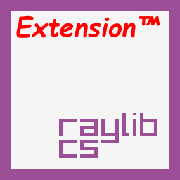

# Raylib-cs.Extension
## attempt to make oop using extensions on top of raylib-cs

todo:
- implement modules
- add comments to methods using cheatsheet
- port examples

there's also Raylib-cs.Extension.Game project to test things i made

---

to use this coolest library you need:
- raylib-cs (at least 4.5.0.4)
- net 6.0 (based version)
